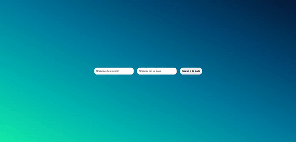

# Socket.IO Room Chat

A real-time browser chat built with **Node.js, Express, and Socket.IO**. Users join a named room, exchange messages, and see the participant list update as people connect and disconnect.



## Run locally

Install Node.js and npm. The project does not pin a Node.js version; its dependencies are from an older Express/Socket.IO generation.

```sh
git clone https://github.com/EladioRocha/socketio-room-chat.git
cd socketio-room-chat
npm ci
npm start
```

Open **http://localhost:3000** in two browser windows, enter the same room with different usernames, and exchange a message. Close one window to check that the participant list updates.

## Project structure

| Path | Purpose |
| --- | --- |
| [server.js](server.js) | Express server, Socket.IO events, and in-memory room state. |
| [index.html](index.html) | Chat page served at the root URL. |
| [public/](public/) | Browser JavaScript and styles. |
| [examples/](examples/) | Demo media. |

## Commands and limitations

- `npm start` runs `node server.js`.
- `npm test` is a placeholder that exits with an error; it is not an automated test suite.
- Rooms and participants are stored in memory and reset when the server restarts.
- This is a learning project. Authentication, durable message history, and production hardening are not established by this example.
